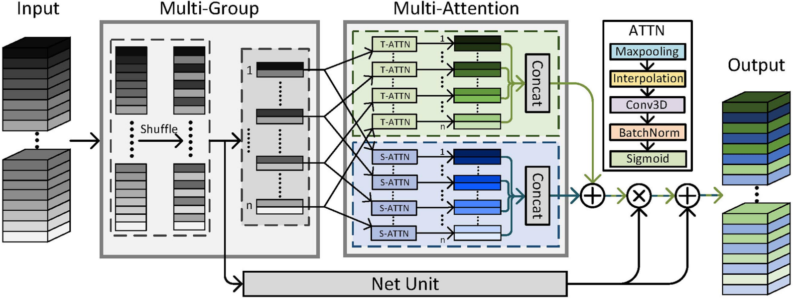

# Multi-Group Multi-Attention: Towards Discriminative Spatiotemporal Representation

We release the code of our paper [MGMA](https://dl.acm.org/doi/10.1145/3394171.3413646). (ACM MM 2020)

```
@inproceedings{shi2020multi,
title={Multi-Group Multi-Attention: Towards Discriminative Spatiotemporal Representation},
author={Shi, Zhensheng and Cao, Liangjie and Guan, Cheng and Liang, Ju and Li, Qianqian and Gu, Zhaorui and Zheng, Haiyong and Zheng, Bing},
booktitle={Proceedings of the 28th ACM International Conference on Multimedia},
pages={2057--2066},
year={2020}
}
```

## Introduction

[MGMA](https://dl.acm.org/doi/10.1145/3394171.3413646) (Multi-Group Multi-Attention) is proposed for learning discriminative spatiotemporal representation in videos, by paying more attention to "where and when" the action happens. We devise a lightweight and flexible yet effective MGMA module for 3D-CNNs, which models spatiotemporal separable attention (T-ATTN and S-ATTN), and adopts multi-group structure for capturing multi-attention information.

<div align="center">
  
</div>

This code is based on the [PySlowFast](https://github.com/facebookresearch/SlowFast) codebase. The core implementation for MGMA are [lib/models/mgma_builder.py](lib/models/mgma_builder.py), [lib/models/mgma_helper.py](lib/models/mgma_helper.py), and an efficient implementation [lib/models/mgma_shufflenet_builder.py](lib/models/mgma_shufflenet_builder.py).

## Requirements

- Python >= 3.7
- Numpy
- PyTorch 1.8
- [fvcore](https://github.com/facebookresearch/fvcore/): `pip install 'git+https://github.com/facebookresearch/fvcore'`
- [torchvision](https://github.com/pytorch/vision/) that matches the PyTorch installation.
  You can install them together at [pytorch.org](https://pytorch.org) to make sure of this.
- simplejson: `pip install simplejson`
- GCC >= 4.9
- PyAV: `conda install av -c conda-forge`
- ffmpeg (4.0 is prefereed, will be installed along with PyAV)
- PyYaml: (will be installed along with fvcore)
- tqdm: (will be installed along with fvcore)
- iopath: `pip install -U iopath` or `conda install -c iopath iopath`
- psutil: `pip install psutil`
- OpenCV: `pip install opencv-python`
- torchvision: `pip install torchvision` or `conda install torchvision -c pytorch`

## Datasets

#### UCF-101
- Download the dataset and annotations from [dataset provider](https://www.crcv.ucf.edu/data/UCF101.php).
- Prepare the csv files for training, validation, and testing set as `train.csv`, `val.csv`, `test.csv`. The format of the csv file is:
```
path_to_video_1 label_1
path_to_video_2 label_2
path_to_video_3 label_3
...
path_to_video_N label_N
```
- Put all csv files in the same folder, and set `DATA.PATH_TO_DATA_DIR` to the path.

## Running

- To train and test a MGMA-ResNet-34 model from scratch on UCF-101. You can build variant MGMA-Nets via setting MGMA.TYPE and MGMA.NUM_GROUPS.
  ```
  python tools/run_net.py \
    --cfg configs/Ucf101/UCF101_MGMA.yaml \
    DATA.PATH_TO_DATA_DIR path_to_csv_files \
    MGMA.TYPE TSA \
    MGMA.NUM_GROUPS 8
  ```
  You can also set the variables (DATA_PATH, MGMA_TYPE, MGMA_NUM_GROUPS) in [scripts/run_ucf101_r3d_34.sh](scripts/run_ucf101_r3d_34.sh), and then run the script.
  ```
  bash scripts/run_ucf101_r3d_34.sh
  ```

## Models
We will provide the models and results later.

## Acknowledgement
We really appreciate the contributors of following codebases.

- [facebookresearch/SlowFast](https://github.com/facebookresearch/SlowFast)
- [facebookresearch/VMZ](https://github.com/facebookresearch/VMZ)
- [kenshohara/3D-ResNets-PyTorch](https://github.com/kenshohara/3D-ResNets-PyTorch)
- [megvii-model/ShuffleNet-Series](https://github.com/megvii-model/ShuffleNet-Series)
